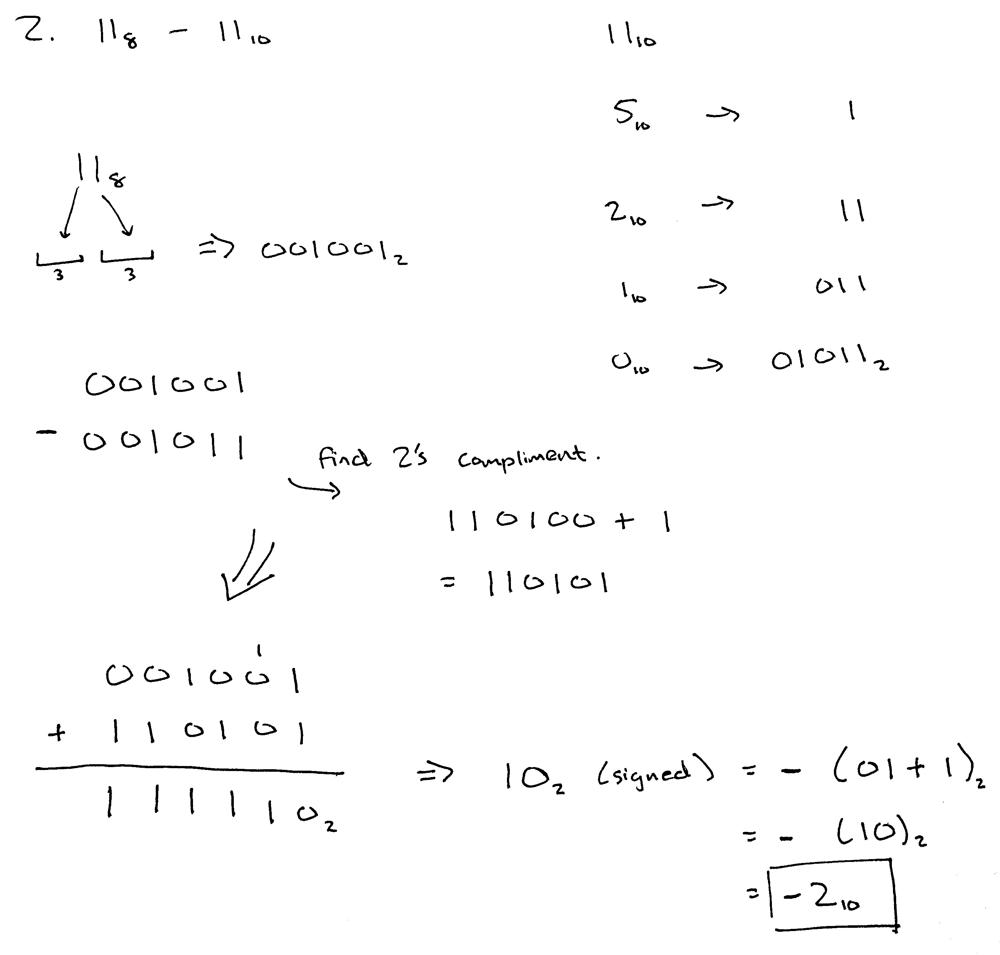
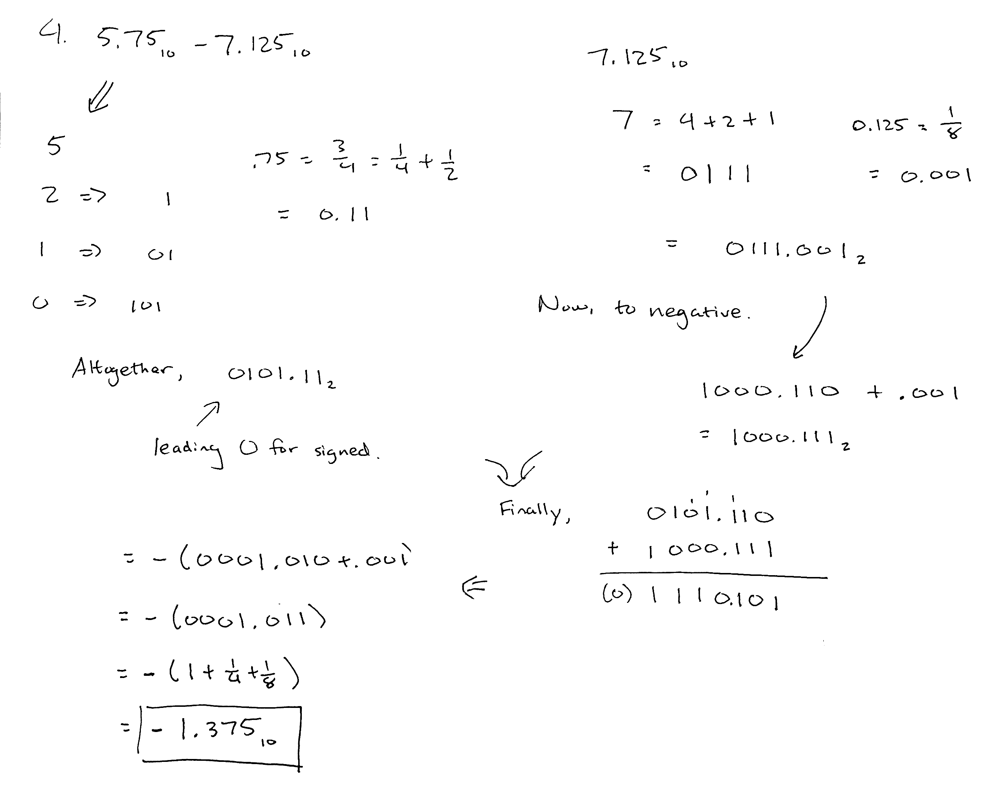

# HW3 Submission

Note: All intermediate binary formats I've chosen to convert to are signed fixed point. I added a `0` or `1` in the beginning to signify this. Number of bits used are extended to what is needed for signed.

Please let me know if I need to update with more bit information.

### 1.

Used 9 bits.

### 2.

Only needs 5 bits.

### 3.

Unsigned here, since both operands are positive. 9 bits used, although it could be done with 8.

### 4.

7 bits used.

### 5.

6 bits used.

### 6.

6 bits for signed 30_10.

### 7.

10 bits for signed 24.9375.

### 8.

10 bits for calculation. Signed number can be represented with 8.
